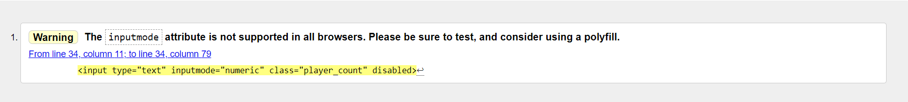
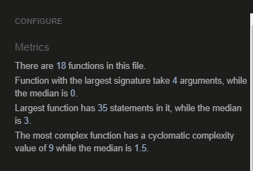

<h1>Portfolio Project 2: Interactive Front-End Development</h1>

<h2>How to play even odd game?</h2>

&nbsp;&nbsp;&nbsp;The player who owns the right to move must guess the even or odd number of balls in the second players hand. If he guesses correctly, he takes as many balls from the second player as he himself holds. And vice versa - if he does not guess, he gives as many balls as the second has in his hand.

<h2>Demo</h2>
<a href="https://sergiykochenko.github.io/ProjectTwo/" rel="nofollow">View the Live Website Here</a>

<h2>Project Goals</h2>

Guessing numbers is a classic Hangman game!

<h3>User Goals</h3>
<ul dir="auto">
<li>Play a fun and engaging word guessing game</li>
<li>Test your general knowledge by guessing different phrases</li>
</ul>

<h2>Design</h2>

&nbsp;&nbsp;&nbsp;The goal of this project is to build a fun interactive memory game where the user can replay as many times as they wish. The game has been designed to target a user of any age; from younger children, who may just want to find the matching pair regardless of time and moves taken, right up to adults.

<h2>Languages Used</h2>
<ul dir="auto">
<li>HTML (Hypertext Markup Language) was used to design the basic website.</li>
<li>CSS (Cascading Style Sheets) to style the website and make it look more appealing to the user.</li>
<li>JavaScript was used to provide interactivity to the application.</li>
</ul>
<h2>Technologies Used</h2>

Git was used for version control.

<a href="https://www.gitpod.io/" rel="nofollow">Gitpod</a> was used for the IDE

<a href="https://fontawesome.com" rel="nofollow">Fontawesome</a> was used for the social media icons, map link and the arrow back to top.

<a href="https://www.google.com/intl/eu/chrome/" rel="nofollow">Google Chrome </a> Google Chrome was used for brings you the best of Google, Get the Browser by Google

<a href="https://replit.com/" rel="nofollow">Replit </a> was used for Coding

<a href="https://helpx.adobe.com/photoshop/using/whats-new.html" rel="nofollow">Adobe photoshop 2022 </a> was used for Icons creation

<a href="https://www.youtube.com/" rel="nofollow">You Tube</a> was used for tutorial education

<ul dir="auto">
<li><a href="https://validator.w3.org/" rel="nofollow">HTML Validator</a></li>
<li><a href="https://validator.w3.org/" rel="nofollow">CSS Validator</a></li>
<li><a href="https://jshint.com/" rel="nofollow">JS Hint</a></li>
</ul>
<h2>Testing</h2>
<h3>Validator Testing</h3>
<ul dir="auto">
<li><a href="https://validator.w3.org/" rel="nofollow">HTML Validator</a> was run at several points during the project and small syntax errors were identified and fixed. At the final stage no errors or warnings were found.
 
  &nbsp;&nbsp;&nbsp;Warning: The inputmode attribute is not supported in all browsers. Please be sure to test, and consider using a polyfill, - Maintainer of the W3C HTML checker (validator) here. That message is just a warning message, not an error. And the reason we have the HTML checker emit that warning is, input type=date isn’t supported in desktop Safari or Internet Explorer, nor in versions of Firefox before Firefox 57, nor on Android before Android 4.4.
</li>
</ul>

<li><a href="https://jigsaw.w3.org/" rel="nofollow">CSS Validator</a> was run several times during the project and picked up small syntax errors which were corrected. At the time of submission the css code successfully passed the validator with no errors.</li>

<li>

<a href="https://jshint.com/" rel="nofollow">JS Hint</a> was used to check the two javascript files. No errors were found and the following metrics were returned:

<ul dir="auto">
<li>There are 18 functions in this file</li>
<li>Function with the largest signature takes 4 argument</li>
<li>Largest function has 35 statements in it, while the median is 3</li>
<li>The most complex funtion has a cyclomatic complexity value of 9 while the median is 1.5.</li>
</ul>
</li>

<ul dir="auto">
<li>Chrome Developer Tools was used in responsiveness design and extensively in debugging javascript functions.</li>
<li>Lighthouse in Chrome Developer Tools was used to check performance and picked up some early contrast errors in colour choice so colours were adjusted accordingly.
<ul dir="auto">
<li>Lighthouse indicated that the background image was large for the site so this was resized without impacting quality and fixed this warning.</li>
<li>An apple touch icon and link was also added to fix a warning regarding this issue. No other significant errors were found.</li>
</ul>
</li>
</ul>
<h3>Lighthouse tests:</h3>

<h2>Manual Testing</h2>

&nbsp;&nbsp;&nbsp;The game was tested by users of various ages. Feedback was overall positive from users. The following constructive feedback was used to make improvements.
  
Mobiles 320x480px scaled down to scale(0.219)  is not supported.

<h2>Performing tests on various devices</h2>

The website was tested on the following devices:

<ul dir="auto">
<li>Apple iPhone 12 Pro Max iOS 16 (16.0.2)</li>
<li>Samsung (samsung SM-T285) Android 5.1.1 (22)</li>
<li>LENOVO (Lenovo Lenovo TB-X606X) Android 10 (29)</li>
<li>Samsung (samsung SM-T505) Android 11 (30)</li>
</ul>
<h2>Browser Compatability</h2>
<h3>The website was tested on the following browsers:</h3>
<ul dir="auto">
<li>Google Chrome</li>
<li>Mozilla Firefox</li>
<li>Microsoft Edge</li>
</ul>
<h2>Credits</h2>

All images, save the background image were created by the developer.
