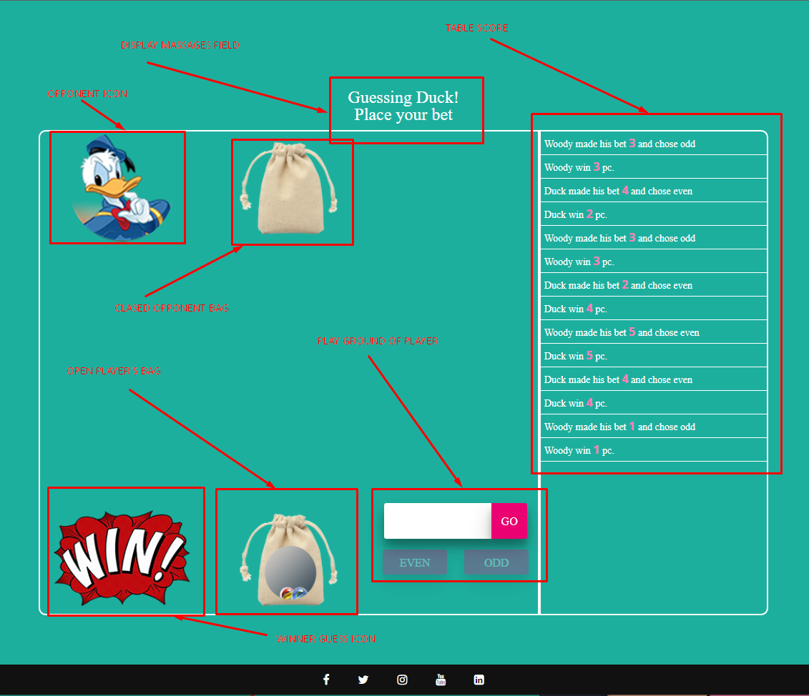
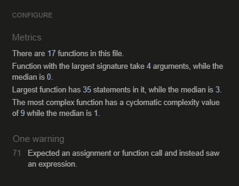

<h1>Portfolio Project 2: Interactive Front-End Development</h1>

<h2>The game was based on the serial  "Game of squid" and the game's rules.</h2>

<h2>How to play even odd game?</h2>

&nbsp;&nbsp;&nbsp;The player who owns the right to move must guess the even or odd number of balls in the second players hand. If he guesses correctly, he takes as many balls from the second player as he himself holds. And vice versa - if he does not guess, he gives as many balls as the second has in his hand.

<h2>Demo</h2>
<a href="https://sergiykochenko.github.io/ProjectTwo/" rel="nofollow">View the Live Website Here</a>
<h2>Project Goals</h2>

&nbsp;&nbsp;&nbsp;Quite interesting and, at the same time, a simple logic game. Try playing it with the computer.

Rules: &nbsp;&nbsp;&nbsp;Each player has 10 stones/balls/small items. Both players take several stones in their hand, squeeze it, and then stretch it forward. The player who owns the right to move must guess the even or odd number of stones in the second player's hand. If he guesses correctly, he takes as many stones from the second player as he himself holds. And vice versa - if he doesn’t guess, he gives as many stones as the second one has in his hand. The winner is the one who ends up with 20 stones.

<h3>User Goals</h3>
<ul dir="auto">
<li>Play a fun and engaging numbers guessing game</li>
<li>Test your general knowledge by guessing different numbers</li>
<h2>Wireframes</h2>
  
All Wireframes were designed for laptop/computer, and mobile display/.

  
</ul>
<h2 dir="auto">Surface/Design</h2>

&nbsp;&nbsp;&nbsp;The goal of this project is to build a fun interactive memory game where the user can replay as many times as they wish. The game has been designed to target a user of any age; from younger children, who may just want to find the matching pair regardless of time and moves taken, right up to adults.

<h2>User Experience</h2>
<h3>Target Audience</h3>
<ul dir="auto">
<li>casual gamers.</li>
<li>people who like play with numbers the game is good for playing in numbers.</li>
<li>people looking for a quick and easy yet engaging game.</li>
</ul>
<h3>User Requirements and Expectations.</h3>
<ul dir="auto">
<li>A simple and intuitive navigation system.</li>
<li>Quick, easy, and fun to play.</li>
<li>Links and functions that work as expected..</li>
<li>Good presentation and a visually appealing design regardless of screen size</li>
<li>Accessibility</li>
</ul>
<h2 dir="auto">Features</h2>

The site consists of one page with a menu header in it you can read the rules of the game, with a play button, and for convenience there is a footer with links to social networks..

<h3 dir="auto">Header</h3>
<ul dir="auto">
<li>Featured on top of page with hidden option on JavaScript once click on play button.</li>
<li>Consists of the game logo on the top of side bar and rules instruction in it.</li>
</ul>

<h3 dir="auto">Play button</h3>
<ul dir="auto">
<li>When you click on the play button, the game is activated and the top menu disappears due to the JavaScript function.</li>
</ul>

<h3 dir="auto">Footer</h3>
<ul dir="auto">
<li>The footer consists of JavaScript social media icons with links.</li>
  <ol dir="auto">
    <li>Facebook JavaScript icon.</li>
    <li>Twitter JavaScript icon.</li>
    <li>Instagram JavaScript icon.</li>
    <li>YouTube JavaScript icon.</li>
    <li>LinkedIn JavaScript icon.</li>
</ol>
</ul>

<h2>Languages Used</h2>
<ul dir="auto">
<li>HTML (Hypertext Markup Language) was used to design the basic website.</li>
<li>CSS (Cascading Style Sheets) to style the website and make it look more. appealing to the user.</li>
<li>JavaScript was used to provide interactivity to the application.</li>
</ul>
<h2>Technologies Used</h2>

Git was used for version control.

<a href="https://www.gitpod.io/" rel="nofollow">Gitpod</a> was used for the IDE

<a href="https://fontawesome.com" rel="nofollow">Fontawesome</a> was used for the social media icons, map link and the arrow back to top.

<a href="https://www.google.com/intl/eu/chrome/" rel="nofollow">Google Chrome </a> Google Chrome was used for brings you the best of Google, Get the Browser by Google

<a href="https://replit.com/" rel="nofollow">Replit </a> was used for Coding

<a href="https://helpx.adobe.com/photoshop/using/whats-new.html" rel="nofollow">Adobe photoshop 2022 </a> was used for Icons creation

<a href="https://www.youtube.com/" rel="nofollow">You Tube</a> was used for tutorial education

<ul dir="auto">
<li><a href="https://validator.w3.org/" rel="nofollow">HTML Validator</a></li>
<li><a href="https://validator.w3.org/" rel="nofollow">CSS Validator</a></li>
<li><a href="https://jshint.com/" rel="nofollow">JS Hint Validator</a></li>
</ul>
<h2>Testing</h2>
<h3>Validator Testing</h3>
<ul dir="auto">
<li><a href="https://validator.w3.org/" rel="nofollow">HTML Validator</a> was run at several points during the project and small syntax errors were identified and fixed. At the final stage no errors or warnings were found.
 
  Tested "index.html":
  &nbsp;&nbsp;&nbsp;Warning: The inputmode attribute is not supported in all browsers. Please be sure to test, and consider using a polyfill, - Maintainer of the W3C HTML checker (validator) here. That message is just a warning message, not an error. And the reason we have the HTML checker emit that warning is, input type=date isn’t supported in desktop Safari or Internet Explorer, nor in versions of Firefox before Firefox 57, nor on Android before Android 4.4.
</li>
</ul>

Tested  "404.html"

<li><a href="https://jigsaw.w3.org/" rel="nofollow">CSS Validator</a> was run several times during the project and picked up small syntax errors which were corrected. At the time of submission the css code successfully passed the validator with no errors.</li>

<a href="https://jshint.com/" rel="nofollow">JS Hint</a> was used to check the javascript file. No errors were found and the following metrics were returned:

<ul dir="auto">
  <li>There are 17 functions in this file</li>
  <li>Function with the largest signature takes 4 arguments, while the median is 0.</li>
  <li>Largest function has 35 statements in it, while the median is 3</li>
  <li>The most complex funtion has a cyclomatic complexity value of 9 while the median is 1.</li>
  <li>15 warnings see below img.</li>
</ul>

<ul dir="auto">
<li> 
<a href="https://www.google.com/intl/eu/chrome/" rel="nofollow">Google Chrome </a>
Chrome Developer Tools was used in responsiveness design and extensively in debugging javascript functions.</li>
<li>Lighthouse in Chrome Developer Tools was used to check performance and picked up some early contrast errors in colour choice so colours were adjusted accordingly.
<ul dir="auto">
<li>Lighthouse indicated that the background image was large for the site so this was resized without impacting quality and fixed this warning.</li>
<li>An apple touch icon and link was also added to fix a warning regarding this issue. No other significant errors were found.</li>
</ul>
</li>
</ul>
<h3>Lighthouse tests:</h3>

Decktop test

Mobile test

<h2>Manual Testing</h2>

&nbsp;&nbsp;&nbsp;The game was tested by users of various ages. Feedback was overall positive from users. The following constructive feedback was used to make improvements.
  
Mobiles 320x480px scaled down to scale(0.219)  are not supported.

Test in console Developer tools web-browser: 
console.log("Computer's chose odd");  
console.log("Computer's chose even"); 
console.log('computer bet -' + guessCompBalls);

Testing score of balls on players: 
CSS option - remove the display: none; 

<h2>Performing tests on various devices</h2>

The website was tested on the following devices:

<ul dir="auto">
<li>Apple iPhone 12 Pro Max iOS 16 (16.0.2)</li>
<li>Samsung (samsung SM-T285) Android 5.1.1 (22)</li>
<li>LENOVO (Lenovo Lenovo TB-X606X) Android 10 (29)</li>
<li>Samsung (samsung SM-T505) Android 11 (30)</li>
</ul>
<h2>Browser Compatability</h2>
<h3>The website was tested on the following browsers:</h3>
<ul dir="auto">
<li>Google Chrome</li>
<li>Mozilla Firefox</li>
<li>Microsoft Edge</li>
</ul>
<h2>Credits</h2>

All images, save the background image were created by the developer.

<h3>Bugs</h3>

The following bug was found:

Mobiles 320x480px scaled down to scale(0.219) are not supported.

Error was found in the JavaScript code, - the messages about the results of the players' moves was not displayed correctly in the table.
 
The bug has been fixed by makeing the function not recylable.

<h3>Deployment</h3>

The website was deployed using Replit and linked to Gitpot the  Gitpot to GitHub with all necessary commita and pusshes by following these steps on GitHub Pages:

<ol dir="auto">
<li>In the GitHub repository navigate to the Settings tab</li>
<li>On the left-hand menu select Pages</li>
<li>For the source select Branch: main</li>
<li>After the webpage refreshes automatically you will ses a ribbon on the top saying: "Your site is published at <a href="https://sergiykochenko.github.io/ProjectTwo/" rel="nofollow">https://sergiykochenko.github.io/ProjectTwo/</a></li>
</ol>

You can fork the repository by following these steps:

<ol dir="auto">
<li>Go to the GitHub repository</li>
<li>Click on Fork button in the upper right hand corner</li>
</ol>

You can clone the repository by following these steps:

<ol dir="auto">
<li>Go to the GitHub repository</li>
<li>Locate the Code button above the list of files and click it</li>
<li>Select if you prefer to clone using HTTPS, SSH, or Github CLI and click the copy button to copy the URL to your clipboard</li>
<li>Open Git Bash</li>
<li>Change the current working directory to the one where you want the cloned directory</li>
<li>Type git clone and paste the URL from the clipboard ($ git clone <a href="https://github.com/YOUR-USERNAME/YOUR-REPOSITORY">https://github.com/YOUR-USERNAME/YOUR-REPOSITORY</a>)
<li>Press Enter to create your local clone.</li>
</ol>
<h2>Acknowledgments</h2>
<ul dir="auto">
<li>Special thanks to my class mates and class teacher Irene Neville, advice guidance and support.</li>
<li>My family for supporting me, advice with design , help with testing, and for giving me some kids free time to work on my project. My 8 years old daughter love thi game.</li>
</ul>